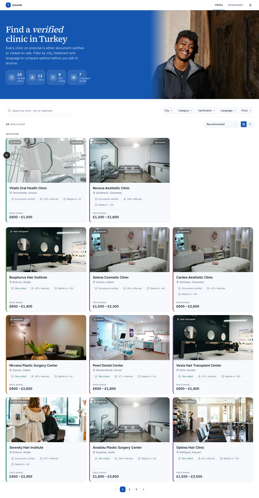
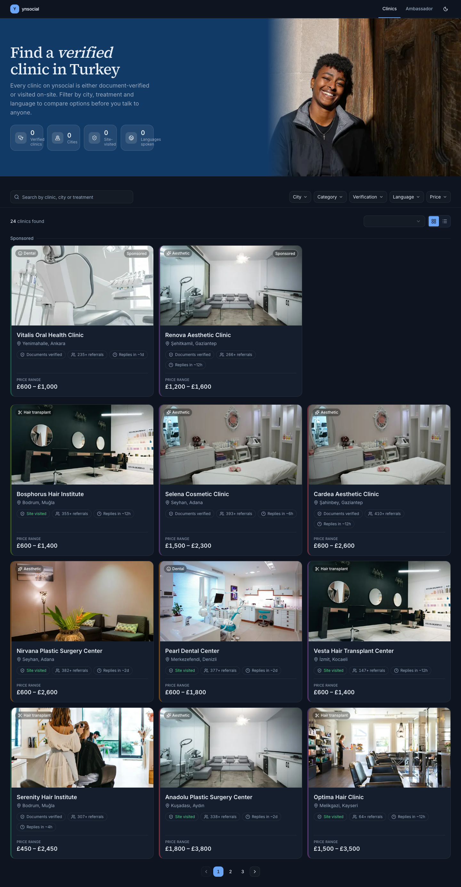
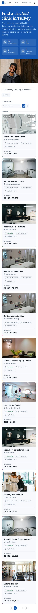
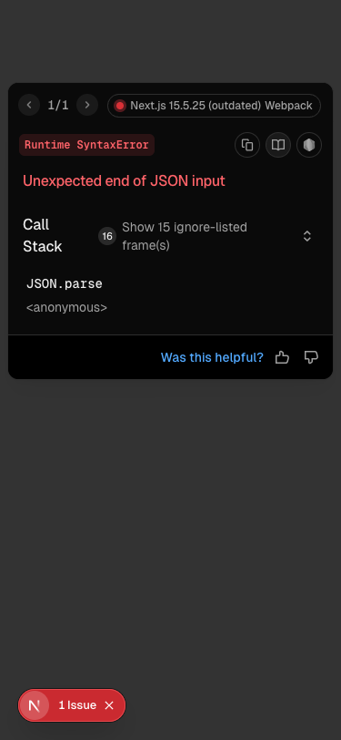
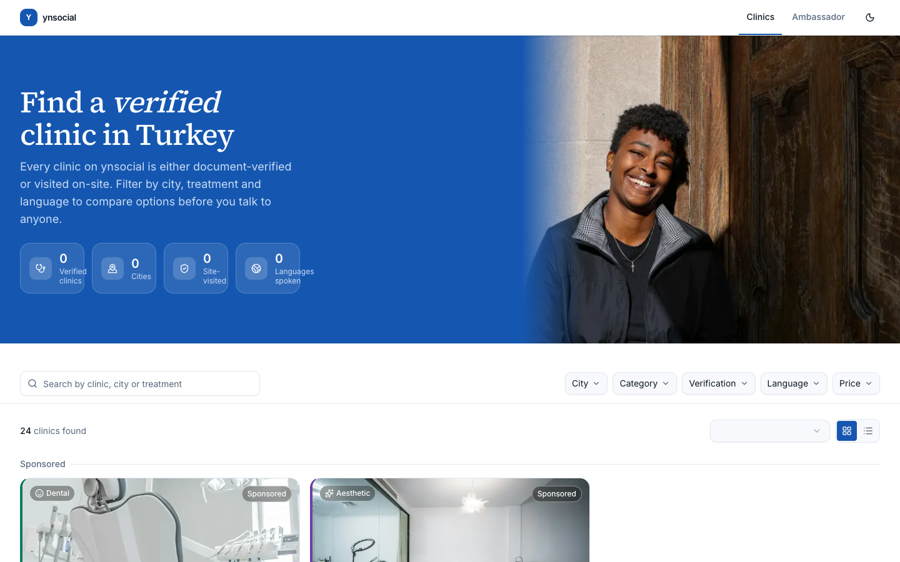
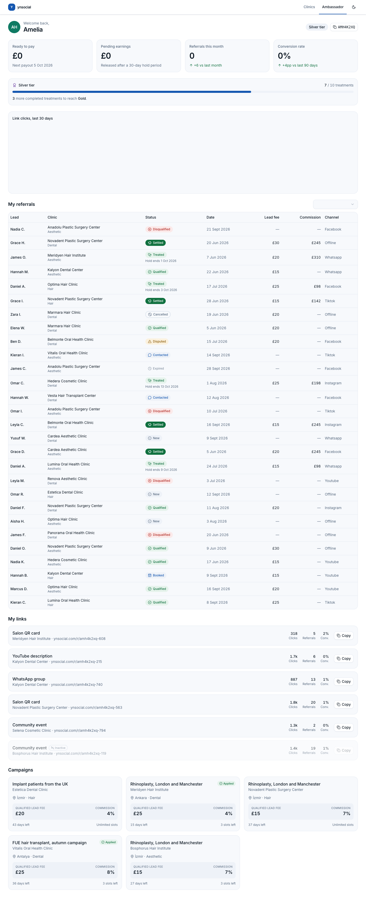
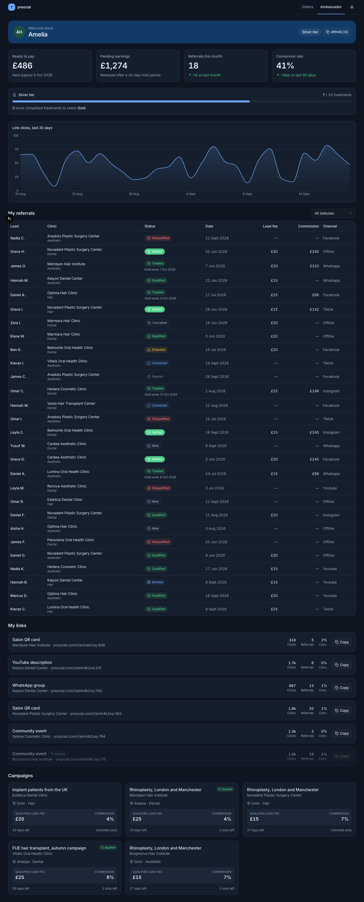
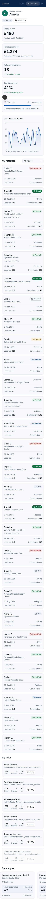
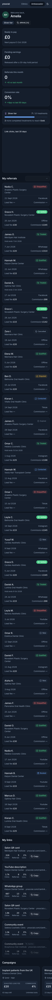

# ynsocial — health tourism marketplace (deneme görevi)

Two pages for a health-tourism referral marketplace, built to the brief in
[`BRIEF.md`](./BRIEF.md) and [`docs/`](./docs): a public, filterable clinic
directory (`/clinics`) and a data-dense ambassador dashboard (`/ambassador`).
Mock data only — no backend, no auth, no database.

## Setup

```bash
pnpm install
pnpm dev
```

Open [http://localhost:3000](http://localhost:3000) — it redirects to
`/clinics`. Use the top nav to switch to `/ambassador`.

```bash
pnpm typecheck   # tsc --noEmit
pnpm lint        # eslint
pnpm build       # production build
```

Both pages are exported with `dynamic = "force-dynamic"` so the mock
network delay (300–600ms, `src/data/delay.ts`) and its loading skeleton
actually run on every visit in production, not just once at build time.
Disable the delay with `NEXT_PUBLIC_DISABLE_MOCK_DELAY=1` if you want to
QA the app without waiting on it.

## Stack

Fixed by the brief: Next.js (App Router), TypeScript (`strict`), React,
Tailwind CSS, shadcn/ui. Added on top, each for a specific reason:

- **`next-themes`** — light/dark with system-preference detection, persisted
  choice, and no flash-of-wrong-theme on load.
- **`recharts`** — the click chart. SVG-based, themeable via CSS variables,
  small enough not to matter here.
- **`vaul`** (via shadcn's `drawer` component) — the draggable bottom sheet
  used for mobile filters. Building drag-to-dismiss physics by hand wasn't
  worth it for one component.
- **`clsx` + `tailwind-merge`** — the standard `cn()` helper for conditional
  class merging: shadcn's generated components expect it.

I deliberately pinned the shadcn CLI to `3.4.0`. The current `latest`
(`4.21`) ships a new default style built on Base UI instead of Radix, with
its own bundled Tailwind stylesheet — a very recent, less-documented stack I
didn't want to build a whole design system on top of blind. `3.4.0` gives
the classic Radix-based primitives, which I then re-themed from scratch
anyway (see below), so nothing about the visual result depends on this
choice — it was purely a reliability call.

## AI usage

Built with Claude Code, following the order suggested in
[`docs/05-CLAUDE-ILE-CALISMA.md`](./docs/05-CLAUDE-ILE-CALISMA.md): project
scaffold and token layer first (colors, type scale, spacing, radius, motion
— decided by hand, not delegated), then one component (the clinic card)
until it was right, then the grid and empty/loading states, then the filter
system, then the ambassador page, then a polish pass on focus rings,
alignment and the arbitrary-value grep checks below.

Where this mattered most: the default AI output for "a clinic card" or "a
status badge system" is generic — every badge gets its own bright color,
every card gets a drop shadow, dark mode is `dark:` classes bolted onto a
light design. The corrections that made a difference were specific and
given up front: fixed hex values and measured contrast for both themes
before any component existed; an explicit rule that the 10 referral
statuses map to four *tone families*, not ten colors; a rule that sponsored
listings get a plain text label and neutral border, never a brighter fill;
one accent color, reserved for exactly the tier badge and nothing else. I
reviewed and adjusted every generated file — nothing shipped unread.

## Design tokens

All of it lives in [`src/app/globals.css`](./src/app/globals.css) as CSS
custom properties, mapped into Tailwind's `@theme` so `bg-surface`,
`text-text-muted`, `rounded-lg` etc. read from the same source. No
component sets a one-off color, size or spacing value — see
**Discipline checks** below for how that's verified.

### Color

The brief's reference palette (`docs/02-TASARIM-YONU.md`) was already
measured and AA/AAA-compliant, so I used it as the base rather than
inventing a new blue for its own sake, and added one thing of my own: a
single violet **brand accent**, used in exactly two places — the ambassador
tier badge icon and the "Featured" clinic tag — everywhere else stays on
the blue/neutral/status palette, per the brief's "one accent, used
sparingly" rule.

**Light theme**

| Token | Hex | Role |
|---|---|---|
| `--bg` | `#FFFFFF` | Page background |
| `--surface` | `#F7F9FC` | Cards, panels |
| `--surface-2` | `#EEF2F8` | Nested surfaces, hover states |
| `--border` | `#E2E8F1` | Default border |
| `--border-strong` | `#C7D2E0` | Emphasised border (empty states) |
| `--text` | `#0C1722` | Primary text |
| `--text-muted` | `#55677D` | Secondary text |
| `--primary` | `#1557B0` | Buttons, links, active states |
| `--primary-hover` | `#10458C` | Primary hover |
| `--success` | `#10703F` | Positive status |
| `--warning` | `#8A5A06` | Disputed status |
| `--danger` | `#B02620` | Negative status |
| `--brand` (accent) | `#6E3FA3` | Featured tag, tier badge |
| `--hero-bg` | `#1557B0` | Clinics hero band, ambassador greeting card |
| `--hero-text` | `#FFFFFF` | Text/icons on the hero band |
| `--hero-text-muted` | `#C9DCF5` | Secondary text on the hero band |

**Dark theme** — a separate design, not an inverted light theme. Ground is
a dark navy-slate (`#0E1520`), never pure black; text is a cool off-white
(`#E8EEF6`), never pure white; depth comes from three flat surface steps,
not shadows; the blue lightens and desaturates rather than staying the
light-mode tone verbatim.

| Token | Hex | Role |
|---|---|---|
| `--bg` | `#0E1520` | Page background |
| `--surface` | `#151E2C` | Cards, panels |
| `--surface-2` | `#1C2738` | Nested surfaces, hover states |
| `--border` | `rgba(255,255,255,.08)` | Default border |
| `--border-strong` | `rgba(255,255,255,.14)` | Emphasised border |
| `--text` | `#E8EEF6` | Primary text |
| `--text-muted` | `#9AACC2` | Secondary text |
| `--primary` | `#6BA5F5` | Buttons, links, active states |
| `--primary-hover` | `#8FBAF7` | Primary hover |
| `--success` | `#4ED08A` | Positive status |
| `--warning` | `#E3B341` | Disputed status |
| `--danger` | `#F87171` | Negative status |
| `--brand` (accent) | `#B79AE0` | Featured tag, tier badge |
| `--hero-bg` | `#123A66` | Clinics hero band, ambassador greeting card |
| `--hero-text` | `#E8EEF6` | Text/icons on the hero band |
| `--hero-text-muted` | `#9AACC2` | Secondary text on the hero band |

### Measured contrast ratios

WCAG AA requires 4.5:1 for normal text, 3:1 for large text/UI components.
All twelve pairs below clear AA; most clear AAA (7:1).

| Pair | Light | Dark |
|---|---|---|
| Primary text / background | 18.08:1 | 15.69:1 |
| Secondary text / background | 5.80:1 | 7.90:1 |
| Primary color / background | 6.95:1 | 7.26:1 |
| Success / background | 6.16:1 | 8.54:1 |
| Danger / background | 6.68:1 | 6.05:1 |
| Brand accent / background | 7.23:1 | 7.60:1 |
| Hero text / hero band | 6.95:1 | 9.87:1 |
| Hero muted text / hero band | 4.98:1 | 4.97:1 |

The light-theme figures for the first six pairs come from the brief's own
pre-verified reference palette (`docs/02-TASARIM-YONU.md`), which I adopted
unchanged for those roles. Every other figure — both dark-theme columns,
the brand accent, and the hero band — I computed myself (WCAG
relative-luminance formula) since those are values I chose.
Button fill contrast (white-on-primary / dark-text-on-primary) was checked
separately and lands at 6.95:1 and 7.35:1 respectively.

### Typography

Inter (`next/font/google`) for everything, plus Source Serif 4 used in
exactly one place — the `/clinics` hero heading — to carry a touch of
"modern luxury" on the marketing-facing page without bringing a second
typeface into the data-dense panel, where the brief asks for density and
legibility over character.

9-step scale, each size paired with a fixed line-height:

| Token | Size | Line-height | Typical use |
|---|---|---|---|
| `2xs` | 11px | 16px | Micro labels (price-range eyebrow) |
| `xs` | 12px | 16px | Meta text, table cells |
| `sm` | 14px | 20px | Secondary UI text, table cells |
| `base` | 16px | 26px | Body copy (never smaller) |
| `lg` | 18px | 28px | Lead paragraph |
| `xl` | 20px | 28px | Card/section subheadings |
| `2xl` | 24px | 30px | Section headings |
| `3xl` | 32px | 38px | Page subheadings |
| `4xl` | 40px | 46px | — |
| `5xl` | 48px | 52px | `/clinics` hero (serif) |

### Spacing

Base unit 4px. Tailwind's default numeric spacing scale already lands on
exactly the brief's allowed steps (`p-1`→4px … `p-20`→80px), so no custom
scale was needed — just discipline about which steps to use: **4, 8, 12,
16, 20, 24, 32, 40, 48, 64, 80**, nothing in between.

### Radius

| Token | Value | Use |
|---|---|---|
| `--radius-sm` | 6px | Checkboxes, small chips |
| `--radius-md` | 10px | Buttons, inputs |
| `--radius-lg` | 16px | Cards |
| `--radius-xl` | 20px | Bottom sheet, mobile cards |

### Motion

| Token | Duration | Easing | Use |
|---|---|---|---|
| `--duration-hover` | 150ms | `ease-out` | Color/background transitions |
| `--duration-popover` | 180ms | `cubic-bezier(.16,1,.3,1)` | Popovers, dropdowns |
| `--duration-sheet` | 300ms | `cubic-bezier(.32,.72,0,1)` | Bottom sheet |
| `--duration-view` | 220ms | `ease-out` | Layout/view changes |
| `--duration-theme` | 200ms | `ease-in-out` | Light/dark crossfade |

`prefers-reduced-motion: reduce` is honored globally (`globals.css`): every
transition and animation collapses to near-zero duration.

## Key design decisions

**1. One card component, two layouts.** `ClinicCard` (`src/components/clinics/clinic-card.tsx`)
takes a `variant: "grid" | "list"` prop and switches its own internal flex
direction and information density — the list variant additionally shows
service chips and languages, since the brief calls for "more information"
in that layout. There is no second, copy-pasted card component.

**2. Trust signals replace the missing rating system.** The product
deliberately has no star ratings or reviews (`docs/01-PROJE.md`). Instead
every clinic card leads with verification level, completed-referral count
and average response time — real, non-fabricated numbers already in the
data. No invented stats were added anywhere.

**3. Category photography instead of a gray placeholder box, with a
deterministic accent to keep clinics distinguishable.** `logoUrl`/`coverUrl`/
`avatarUrl` point to files that don't exist — deliberately, per
`docs/04-VERI.md`. The brief's own suggested fixes include "a color system
by category"; I extended that to photography instead of flat color: a
small pool of three free-license photos per category (`public/images/clinics`,
`src/lib/clinic-photo.ts`), assigned deterministically so a given clinic
always shows the same photo. Photos represent the *category*, not that
specific clinic's real premises — I'm not fabricating a building that
doesn't exist, just choosing a systematic visual language, the same way a
"color by category" system would be. Individual clinics still get their own
persistent identity: a 4px accent stripe down the card's left edge, colored
by the same hash-based 8-swatch palette used earlier for the ambassador
avatar (`src/lib/deterministic-color.ts`), which has no photo option at all
since it's a specific person, not a category.

The photo-assignment hash needed a second pass: hashing the clinic `id`
alone and taking it mod 3 produced a bad split (6 of 8 dental clinics
landing on the same photo) because ids are sequential per category
(`cl_001`, `cl_002`, …) and correlated badly with a modulus that small.
Hashing `id + category` together and discarding the low 8 bits before the
modulo fixed it to a near-even 3/2/3 split — worth knowing since it's the
kind of bug that looks fine in code review and only shows up once you
actually look at the rendered grid.

**4. A four-family status system for 10 referral statuses**, not ten
colors (`src/components/ambassador/status-badge.tsx`): neutral (`new`),
info (`contacted`, `booked`), a three-step positive progression
(`qualified` → `treated` → `settled`, increasing in visual weight, ending
in a solid fill for the strongest state), and two negative weights
(`disqualified` filled, `cancelled` as a soft outline — cancelling is a
different, less final event than being rejected). Every badge pairs its
color with a distinct icon, so status is never carried by color alone.

**5. Filtering never re-hits the server.** `/clinics` fetches the full
24-record list once per page load (behind the loading skeleton), then
`ClinicsExplorer` does all filtering, sorting and pagination client-side.
The URL is still kept in sync — via the History API directly
(`history.replaceState` + a `popstate` listener), not `router.replace` —
specifically so that ticking a filter checkbox never triggers a Next.js
navigation, which would re-run the mock delay and flash the loading
skeleton on every click. Reload and back/forward both restore the exact
filter state from the URL, as required. The search-and-filter row is also
sticky just below the nav (`top-14`), so it stays reachable while scrolling
a long result list instead of requiring a trip back to the top.

**A note on "calm" vs. "lifeless."** An early pass read as flat rather than
restrained — same problem the brief warns against just from the other
direction. The fix wasn't more color: it was a light-to-dark sheen on each
identity swatch instead of a flat fill, a short staggered rise for cards on
load (`docs/02-TASARIM-YONU.md`'s own suggestion, capped under 300ms total
and skipped under `prefers-reduced-motion`), a one-time count-up on the
ambassador summary numbers, and a small real-numbers stat strip under the
`/clinics` hero. None of it touches the palette or adds a second accent
color — it's the same "sakin" system with more conviction in its own
typography and motion, not more decoration.

**A second round, and one reverted experiment.** The white chrome itself
still read as empty separately from card content — nav bar, page
background, all plain white. First attempt: a solid navy nav bar fill.
It tested worse, not better — it read as a heavier, cheaper-looking bar
sitting on top of the actual content, and none of the references I was
matching against (BitPan, Furns) use a colored nav either; their premium
feel comes entirely from photography, type and whitespace. I reverted the
nav to its original white/blurred style and put the effort where it
actually paid off: real photography on every clinic card (decision 3
above), a soft single-hue gradient wash on the `/clinics` hero (`color-mix`
from `--primary` into `--surface`), and — the actual fix — a hero that
finally *has* something in it (next paragraph). A concrete example of a
design call that looked reasonable on paper and didn't survive contact
with a screenshot.

**A split hero instead of a text block on a gradient.** Even with the
gradient wash, a headline and four stat numbers over empty space still
read as thin. The `/clinics` hero is now two columns on desktop — copy and
the trust-stat tiles on the left, a real photo filling the right half,
matching the confident editorial layout of the references I was asked to
match (BitPan, Furns: big photo, bold headline, generous whitespace) —
and stacks to photo-below-copy on mobile rather than disappearing. The nav
bar gained the same idea in miniature: a small colored logomark next to
the wordmark, and the active link is marked with an underline in
`--primary` instead of a filled pill, which reads as a deliberate,
designed indicator rather than a flat color block sitting on the bar.

**Stat tiles instead of a row split by dividers.** The four trust
numbers under the hero used to be plain text separated by `divide-x`
hairlines — on any width where they wrapped to a second line, the line
that was supposed to separate two numbers ended up next to nothing,
looking like a rendering bug rather than a design. Each stat is now its
own bordered tile with an icon chip, arranged in a proper 2×2 / 4-across
grid — it survives wrapping at any width because each tile is a complete,
self-contained unit instead of one item in a divided row.

**The hero went from a wash to a solid fill.** Even split into two columns
with a photo, a 12%-tint gradient still read as "a white page with a hint
of blue" rather than a page with actual color in it — which was the
direct, repeated piece of feedback on this project. The `/clinics` hero
band (and a compact version of the `/ambassador` greeting card, for the
same reason) now use `--hero-bg`, a full, solid fill in the same blue as
`--primary` — not a new hue, just the existing one used at 100% instead of
12%. Text on it goes to white/off-white (`--hero-text`), the trust tiles
become translucent white chips instead of tinted-white-on-white, and the
headline's emphasis switched from a color trick (which stops working the
instant the background *is* that color) to italics — the same device the
BitPan reference uses for its own emphasized words. This is the one
department where I intentionally pushed past "restrained" toward "bold,"
on direct request — still one hue, but at full strength and covering a
large surface, rather than confined to small chips.

First pass at this put the photo in a rounded, bordered box floating
inside the blue — on review that read as a widget sitting on the section,
not a photo *of* the section, which is exactly the "template" feel the
brief warns against. The photo now bleeds to the true edge on desktop
(absolutely positioned, no radius, no border, a left-edge gradient feathering
it into `--hero-bg` instead of a hard seam) and becomes a full-width strip
below the copy on mobile rather than disappearing. Small change, but it's
the difference between "a photo was added" and "the section was designed
around a photo."

## How the two pages stay one system while looking different

`/clinics` is the marketing face: generous whitespace, a serif display
headline, 16–20px body text, three-column cards. `/ambassador` is the
working tool: tighter vertical rhythm, a dense table, four-up summary
cards, no serif anywhere. What ties them together on purpose: identical
color tokens and both themes, the same card corner-radius and border
treatment, the same badge/chip shapes, the same `tabular-nums` treatment
for every number, the same focus ring, and the same top nav. The
difference is entirely in density and typographic voice, not in the
underlying material.

## "Recommended" sort

Since there's no rating system, "recommended" is a weighted blend of the
three real trust signals the platform does have
(`src/components/clinics/lib/clinics-filter.ts#recommendedScore`):

```
score = verification × 0.40 + normalizedReferrals × 0.35 + normalizedSpeed × 0.25
```

`site_visited` scores higher than `documents_verified` (it's the stronger
signal per `docs/01-PROJE.md`); completed referrals and response time are
normalized against the current result set's max, so the ranking adapts
sensibly as filters narrow the pool. **Sponsorship never enters this
formula** — sponsored listings are pulled into their own block above the
grid instead of being boosted in it.

## Sponsored listings

Both sponsored clinics get a plain `Sponsored` text-and-icon label on a
translucent neutral chip — same size, weight and corner radius as the
category badge next to it, not a brighter color, not a bigger card, not
its own accent. They sit in their own labeled section above the organic
grid (still filtered by the active search/city/category/etc., so an
irrelevant sponsored result never shows), so the separation from organic
results is structural rather than decorative. The intent: identifiable at
a glance, never mistaken for the platform's own recommendation, never
competing visually with the trust-first tone the brief asks for.

## What I'd do differently with more time

- **Facet counts recompute on every filter change** by re-scanning all 24
  records — fine at this size, but I'd memoize per-dimension counts
  properly (or move to a small index) before this data set grows.
- **The click chart has no keyboard-accessible data table fallback** —
  Recharts' SVG isn't screen-reader friendly out of the box, and I didn't
  have time to add a visually-hidden data table alongside it.
- **The 8 deterministic identity swatches** are hand-picked, not
  individually contrast-verified against white — they're all in a similar
  dark tonal range by construction, but I'd run each through a contrast
  checker rather than eyeballing it.
- The desktop clinic filters live in five separate popovers rather than a
  persistent sidebar. It reads cleaner at this filter count and matches
  the "modern, uncluttered" brief, but a sidebar would scale better if
  more filter dimensions were added later.

## Photo credits

The 9 category photos in `public/images/clinics/` and the `/clinics` hero
photo (`public/images/hero-clinics.jpg`) are from
[Unsplash](https://unsplash.com), used under the
[Unsplash License](https://unsplash.com/license) (free for commercial use,
no permission or attribution required). The category photos represent
each treatment category generically, per decision 3 above — not the real
premises of any listed clinic; the hero photo is editorial/decorative.

## Screenshots

All captured from the running app (Puppeteer, not hand-picked crops).

### Clinics — light, desktop


### Clinics — dark, desktop


### Clinics — light, mobile


### Clinics — dark, mobile


### Clinics — empty result state


### Ambassador — light, desktop


### Ambassador — dark, desktop


### Ambassador — light, mobile


### Ambassador — dark, mobile


## Discipline checks

The same checks `docs/05-CLAUDE-ILE-CALISMA.md` says the reviewers will
run:

```bash
# One-off values instead of tokens (should only match vendor shadcn primitives)
grep -rnE "text-\[|#[0-9a-fA-F]{3,6}\]|p-\[|m-\[|w-\[|h-\[" src

# `any` usage
grep -rn "\bany\b" src --include="*.ts" --include="*.tsx"

# outline:none without a designed replacement
grep -rn "outline-none\|outline: none" src
```

The only hits are inside `src/components/ui/*` (shadcn's generated
primitives, using Radix data-attributes and its own `focus-visible:ring-*`
box-shadow focus style instead of the `outline` property) — nothing in
hand-authored code.
